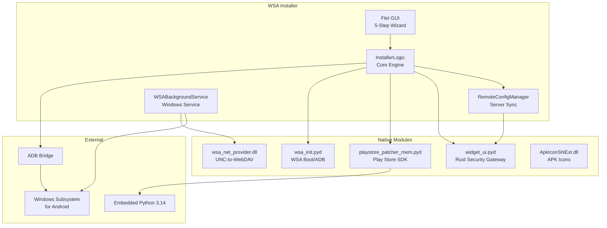

<div align="center">

<a href="https://github.com/WSA-Installer">
  
</a>

# WSA Installer

### The Modern Windows Subsystem for Android Installation & Management Toolkit


[Website](https://wsa-installer-website.vercel.app) · [Download](https://github.com/WSA-Installer/wsa-installer/releases/latest) · [Documentation](https://github.com/WSA-Installer/wsa-installer/tree/main/docs) · [YouTube](https://www.youtube.com/@AT_Tech_Zone)

</div>

---

<br>

## Our Mission

> Provide an easy, powerful, and reliable way to install, repair, update, customize, and manage Windows Subsystem for Android (WSA) with Google Play Store on Windows 10 and Windows 11 — with a beautiful, intuitive interface and advanced automation.

<br>

## Projects

<div align="center">

| Repository | Description | Stars | Language |
|:-----------|:------------|:------|:---------|
| **[wsa-installer](https://github.com/WSA-Installer/wsa-installer)** | Main installer — one-click WSA + Play Store setup with background service, self-update, repair, and file sharing |  |  |
| **[embedded-tools](https://github.com/WSA-Installer/wsa-installer/tree/main/embedded-tools)** | Source code for all native modules — ApkIconShlExt, WSA Net Provider, aapt++ |  |  |
| **[wsa-webdav](https://github.com/WSA-Installer/wsa-webdav)** | Headless Android WebDAV server APK — access WSA file system from any browser with root support |  |  |
| **[wsa-website](https://github.com/WSA-Installer/wsa-website)** | Official website — landing page, documentation, download hub, blog |  |  |
| **[ads-json-data](https://github.com/WSA-Installer/ads-json-data)** | Remote config server — monetization, sponsor content, and update distribution |  |  |

</div>

<br>

## v1.2 — What's New

<div align="center">

| Feature | Description |
|:--------|:------------|
| WSA Pacman | Double-click any APK/XAPK/APKS/APKM to install directly into WSA |
| APK File Handler | Registers as Windows handler for APK files with custom icons in Explorer |
| 3-Phase System Check | System validation → Bundle detection → Virtualization bypass |
| Virtualization Bypass | Auto-fixes Hyper-V, KB uninstall, WSL2, Defender, VBS, FsDepends |
| Win10/Win11 Detection | Smart build detection with appropriate GitHub API source |
| Win10 Bundle | Dedicated offline bundle for Windows 10 users |

</div>

<br>

## Features

<div align="center">

| Feature | Description |
|:--------|:------------|
| Smart System Scan | Detects VT-x/AMD-V, Hyper-V, VirtualMachinePlatform, HypervisorPlatform, WSL via 5 detection methods |
| One-Click Install | Handles download, extraction, configuration, and registration of WSA end-to-end |
| Play Store Integration | Patches Google Apps (MindTheGapps 13.0) with automated ADB authorization |
| Background Service | `WSABackgroundService` monitors WSA status, manages SDK lifecycle, auto-restarts on failure |
| Self-Update | Checks server for updates with 30-chunk parallel download and silent install |
| Repair & Uninstall | Complete WSA management with backup, repair, and clean uninstall flows |
| File Sharing | WebDAV-based drive mounting — access WSA files as Windows network drives |
| Glass Transparency | Modern Windows 11-inspired UI with configurable alpha-blended transparency |
| Remote Config | Server-side configuration updates via Rust security gateway |
| NSIS Installer | Professional Windows setup wizard with maintenance mode |
| Win10/Win11 Bundles | Separate offline bundles for each Windows version |

</div>

<br>

## Technology Stack

<div align="center">


</div>

<br>

## Quick Start

### 1. Download

| File | Size | Description |
|:-----|:-----|:------------|
| [WSA_Installer_Setup.exe](https://github.com/WSA-Installer/wsa-installer/releases/latest) | ~228 MB | Professional NSIS installer |
| [bundle.wsa (Windows 11)](https://github.com/WSA-Installer/wsa-installer/releases/latest) | ~1.21 GB | Pre-packaged WSA bundle for Windows 11 (optional) |
| [bundle_win10.wsa (Windows 10)](https://github.com/WSA-Installer/wsa-installer/releases/latest) | ~1.21 GB | Pre-packaged WSA bundle for Windows 10 (optional) |

### 2. Install

1. Download `WSA_Installer_Setup.exe` from the [latest release](https://github.com/WSA-Installer/wsa-installer/releases/latest)
2. Right-click → **Run as administrator**
3. Follow the 5-step wizard: **Intro → Check → Install → Play Store → Complete**

### 3. Enjoy

- Play Store appears in Start Menu
- Launch Android apps directly
- Background service monitors WSA automatically

<br>

## CLI Reference

```cmd
WSA_Installer_Setup.exe /S                    :: Silent install
WSA_Installer_Setup.exe --repair-wsa          :: Repair WSA
WSA_Installer_Setup.exe --uninstall           :: Uninstall WSA
WSA_Installer_Setup.exe --file-sharing        :: File sharing setup
```

<br>

## Architecture



> Source code for all native modules is available in [embedded-tools](https://github.com/WSA-Installer/wsa-installer/tree/main/embedded-tools).

<br>

## Supported Platforms

<div align="center">

| OS | Status |
|:---|:-------|
| Windows 11 22H2+ |  |
| Windows 11 21H2 |  |
| Windows 10 2004+ (build 19041) |  |
| Windows 10 < 19041 |  |

</div>

<br>

## Community

<div align="center">

[](https://www.youtube.com/@AT_Tech_Zone)
[](https://buymeacoffee.com/mrcyberdev)
[](https://github.com/WSA-Installer/wsa-installer/discussions)

</div>

<br>

## Contributing

We welcome contributions! See our [Contributing Guide](https://github.com/WSA-Installer/wsa-installer/blob/main/CONTRIBUTING.md) for details.

## License

This project is licensed under the **MIT License** — see [LICENSE](https://github.com/WSA-Installer/wsa-installer/blob/main/LICENSE) for details.

---

<div align="center">

**Built with care by [AT Tech Zone](https://www.youtube.com/@AT_Tech_Zone) — MR CYBER**


</div>
