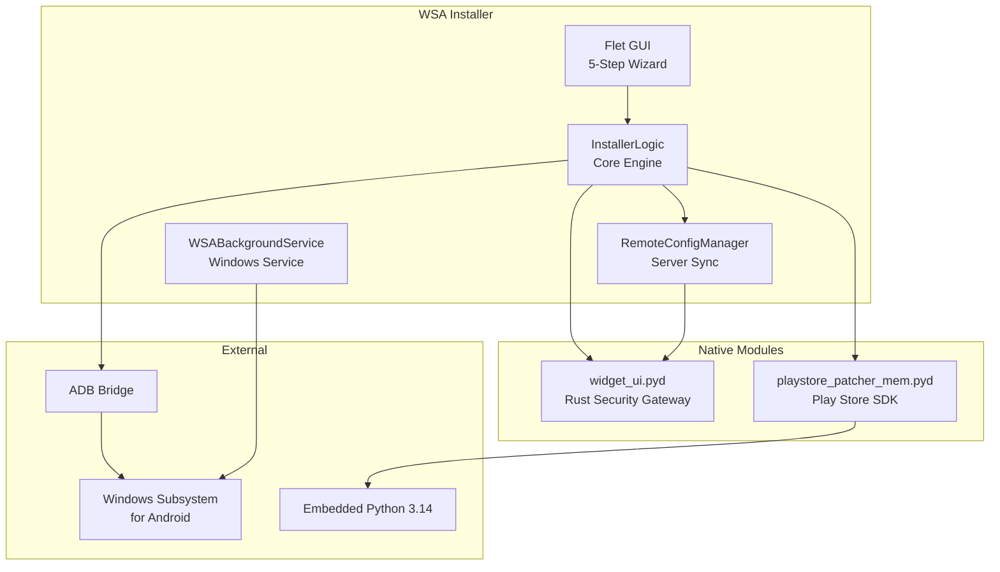

<div align="center">

<picture>
  <source media="(prefers-color-scheme: dark)" srcset="../wsa-installer/assets/logo-dark.svg">
  <source media="(prefers-color-scheme: light)" srcset="../wsa-installer/assets/logo-light.svg">
  
</picture>

# WSA Installer

### The Modern Windows Subsystem for Android Installation & Management Toolkit


[Website](https://wsa-installer.github.io) · [Download](https://github.com/WSA-Installer/wsa-installer/releases/latest) · [Documentation](https://wsa-installer.github.io/docs/) · [YouTube](https://www.youtube.com/@AT_Tech_Zone)

</div>

---

## Our Mission

Provide an easy, powerful, and reliable way to install, repair, update, customize, and manage Windows Subsystem for Android (WSA) with Google Play Store on Windows 10 and Windows 11 — with a beautiful, intuitive interface and advanced automation.

## Projects

| Repository | Description | Status |
|:-----------|:------------|:-------|
| **[wsa-installer](https://github.com/WSA-Installer/wsa-installer)** | Main installer application — one-click WSA + Play Store setup with background service, self-update, repair, and file sharing |  |
| **[wsa-webdav](https://github.com/WSA-Installer/wsa-webdav)** | Headless Android WebDAV server APK for WSA — access your Android file system from any browser |  |
| **[wsa-website](https://github.com/WSA-Installer/wsa-website)** | Official website — landing page, documentation, download hub |  |

## Features

| Feature | Description |
|:--------|:------------|
| Smart System Scan | Detects VT-x/AMD-V, Hyper-V, VirtualMachinePlatform, HypervisorPlatform, WSL via 5 detection methods |
| One-Click Install | Handles download, extraction, configuration, and registration of WSA end-to-end |
| Play Store Integration | Patches Google Apps (MindTheGapps 13.0) with automated ADB authorization |
| Background Service | `WSABackgroundService` monitors WSA status, manages SDK lifecycle, auto-restarts on failure |
| Self-Update | Checks server for updates with 30-chunk parallel download and silent install |
| Repair & Uninstall | Complete WSA management with backup, repair, and clean uninstall flows |
| File Sharing | WebDAV-based drive mounting — access WSA files as Windows network drives |
| Glass Transparency | Modern Windows 11-inspired UI with configurable alpha-blended transparency |
| Remote Config | Server-side configuration updates via Rust security gateway |
| NSIS Installer | Professional Windows setup wizard with maintenance mode |

## Technology Stack

```
┌──────────────────────────────────────────────────────────────┐
│                     Technology Stack                          │
├──────────────────────────────────────────────────────────────┤
│  Python 3.14    │  Flet UI Framework   │  Rust Native (.pyd) │
│  PyQt6          │  PyInstaller         │  Nuitka Compiler    │
│  NSIS           │  ADB                 │  Windows Services   │
│  Kotlin         │  Android SDK         │  WebDAV Protocol    │
└──────────────────────────────────────────────────────────────┘
```

## Quick Start

### Download

| File | Size | Description |
|:-----|:-----|:------------|
| [WSA_Installer_Setup.exe](https://github.com/WSA-Installer/wsa-installer/releases/latest) | ~228 MB | Professional NSIS installer |
| [bundle.wsa](https://github.com/WSA-Installer/wsa-installer/releases/latest) | ~1.21 GB | Pre-packaged WSA bundle (optional) |

### Install

1. Download `WSA_Installer_Setup.exe` from the [latest release](https://github.com/WSA-Installer/wsa-installer/releases/latest)
2. Right-click → **Run as administrator**
3. Follow the 5-step wizard: **Intro → Check → Install → Play Store → Complete**

### CLI

```cmd
WSA_Installer_Setup.exe /S                    :: Silent install
WSA_Installer_Setup.exe --repair-wsa          :: Repair WSA
WSA_Installer_Setup.exe --uninstall           :: Uninstall WSA
WSA_Installer_Setup.exe --file-sharing        :: File sharing setup
```

## Architecture



## Supported Platforms

| OS | Status |
|:---|:-------|
| Windows 11 22H2+ |  |
| Windows 11 21H2 |  |
| Windows 10 2004+ (build 19041) |  |
| Windows 10 < 19041 |  |

## Community

| Channel | Link |
|:--------|:-----|
| YouTube | [@AT_Tech_Zone](https://www.youtube.com/@AT_Tech_Zone) |
| Buy Me a Coffee | [mrcyberdev](https://buymeacoffee.com/mrcyberdev) |
| GitHub Issues | [Report a Bug](https://github.com/WSA-Installer/wsa-installer/issues/new?template=bug_report.yml) |
| GitHub Discussions | [Ask a Question](https://github.com/WSA-Installer/wsa-installer/discussions) |

## Contributing

We welcome contributions! See our [Contributing Guide](https://github.com/WSA-Installer/wsa-installer/blob/main/CONTRIBUTING.md) for details.

## License

This project is licensed under the **MIT License** — see [LICENSE](https://github.com/WSA-Installer/wsa-installer/blob/main/LICENSE) for details.

---

<div align="center">

**Built with care by [AT Tech Zone](https://www.youtube.com/@AT_Tech_Zone) — MR CYBER**


</div>
