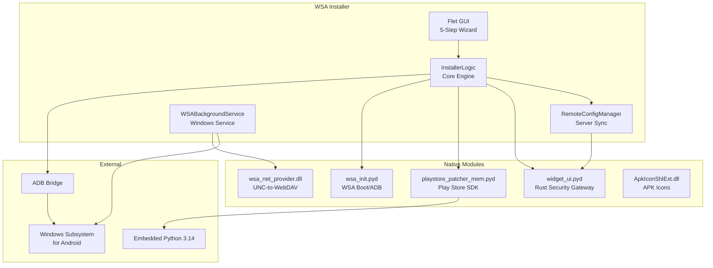

<div align="center">

<a href="https://github.com/WSA-Installer">
  
</a>

# WSA Installer

### The Modern Windows Subsystem for Android Installation & Management Toolkit


**A complete solution for installing Windows Subsystem for Android with Google Play Store on Windows 10/11.**

Built with care by [AT Tech Zone](https://www.youtube.com/@AT_Tech_Zone) — MR CYBER

[Website](https://wsa-installer-website.vercel.app) · [Download](https://github.com/WSA-Installer/wsa-installer/releases/latest) · [Documentation](https://github.com/WSA-Installer/wsa-installer/tree/main/docs) · [YouTube](https://www.youtube.com/@AT_Tech_Zone)

</div>

---

<br>

## Our Mission

> Provide an easy, powerful, and reliable way to install, repair, update, customize, and manage Windows Subsystem for Android (WSA) with Google Play Store on Windows 10 and Windows 11 — with a beautiful, intuitive interface and advanced automation.

<br>

## Projects

<div align="center">

| Repository | Description | Stars | Language |
|:-----------|:------------|:------|:---------|
| **[wsa-installer](https://github.com/WSA-Installer/wsa-installer)** | Main installer — one-click WSA + Play Store setup with background service, self-update, repair, and file sharing |  |  |
| **[embedded-tools](https://github.com/WSA-Installer/wsa-installer/tree/main/embedded-tools)** | Source code for all native modules — ApkIconShlExt, WSA Net Provider, aapt++ |  |  |
| **[wsa-webdav](https://github.com/WSA-Installer/wsa-webdav)** | Headless Android WebDAV server APK — access WSA file system from any browser with root support |  |  |
| **[wsa-website](https://github.com/WSA-Installer/wsa-website)** | Official website — landing page, documentation, download hub, blog |  |  |
| **[ads-json-data](https://github.com/WSA-Installer/ads-json-data)** | Remote config server — monetization, sponsor content, and update distribution |  |  |

</div>

<br>

## What WSA Installer Does

| Capability | Description |
|:-----------|:------------|
| **System Detection** | Automatically scans your system for VT-x/AMD-V virtualization, Hyper-V, VirtualMachinePlatform, HypervisorPlatform, and WSL support |
| **Feature Enabling** | Enables all required Windows features automatically with administrator privileges |
| **Virtualization Bypass** | Auto-fixes compatibility issues: Hyper-V, problematic KBs, WSL2, Defender exclusion, VBS, FsDepends |
| **WSA Download** | Downloads the correct WSA build from GitHub Releases with 30-chunk parallel downloads and resume support |
| **WSA Installation** | Extracts, configures, and registers the Android subsystem with proper Developer Mode settings |
| **Play Store Integration** | Patches Google Apps (MindTheGapps 13.0) onto the WSA installation with automated ADB authorization |
| **WSAPatch Fix** | Applies binary patches to `WsaClient.exe` for Windows 10 compatibility (crash fix) |
| **WSA Pacman** | Double-click any APK/XAPK/APKS/APKM to install directly into WSA with desktop shortcut creation |
| **APK File Handler** | Registers as Windows handler for APK files with custom icons in Explorer |
| **Background Service** | Installs `WSABackgroundService` — monitors WSA status, manages file sharing, handles auto-updates |
| **File Sharing** | WebDAV-based drive mounting for WSA user/root filesystems |
| **Self-Update** | Checks the server for updates and installs them silently without user intervention |
| **Uninstall** | Provides complete WSA removal including services, files, and registry entries |

<br>

## Features

### Core Features

| Feature | Description |
|:--------|:------------|
| 3-Phase System Check | System validation → Bundle detection → Virtualization bypass |
| Smart System Scan | Detects VT-x, Hyper-V, VirtualMachinePlatform, HypervisorPlatform, WSL in real-time |
| Auto Configuration | Enables required Windows features automatically with admin privileges |
| One-Click Install | Handles download, extraction, and setup end-to-end |
| Play Store Patching | Applies Run.bat, WsaClient.exe, ps.ico patches automatically via Rust SDK |
| WSAPatch Fix | Binary patches WsaClient.exe for compatibility on Windows 10 |
| WSA Pacman | Double-click any APK to install directly into WSA (APK/XAPK/APKS/APKM) |
| APK File Handler | Registers as Windows handler for APK files with custom icons |
| Virtualization Bypass | Auto-fixes Hyper-V, KB uninstall, WSL2, Defender, VBS, FsDepends |
| Background Service | `WSABackgroundService` monitors WSA status and manages the SDK |
| Self-Update | Checks server for updates and installs silently |
| Win10/Win11 Detection | Uses appropriate GitHub API source per Windows version |

### Installer Features

| Feature | Description |
|:--------|:------------|
| NSIS Professional Setup | Industry-standard Windows installer with wizard UI |
| Silent Mode | Full `/S` silent install support for automation |
| Maintenance Mode | Repair, reinstall, or uninstall from existing installation |
| UAC Elevation | Automatic administrator privilege request |
| Single Instance | Mutex-based prevents running multiple installer copies |
| Windows 10 Check | Validates minimum OS build before installation |

### UI Features

| Feature | Description |
|:--------|:------------|
| Flet-Based GUI | Modern cross-platform UI framework |
| Glass Transparency | Alpha-blended window transparency (configurable 0-100) |
| 5-Step Wizard | Guided installation flow with 3-phase pre-check |
| Real-Time Progress | Live download progress with speed and ETA |
| Remote Config | Server-side configuration updates without app changes |
| APK Install Dialog | 6-step progress tracker for APK installation |

### Developer Features

| Feature | Description |
|:--------|:------------|
| Source Protection | Nuitka compilation + PyInstaller bundling |
| Rust Native Modules | `widget_ui.pyd` (security gateway) + `playstore_patcher_mem.pyd` (SDK) |
| Embedded Python 3.14 | Self-contained runtime for Play Store patcher |
| Activity Logging | Session-based logging to `wsa_activity.log` |
| Config Controller | Source-tracked configuration (default → dev → server) |

<br>

## Technology Stack

<div align="center">


</div>

<br>

## Quick Start

### 1. Download

| File | Size | Description |
|:-----|:-----|:------------|
| [WSA_Installer_Setup.exe](https://github.com/WSA-Installer/wsa-installer/releases/latest) | ~228 MB | Professional NSIS installer |
| [bundle.wsa (Windows 11)](https://github.com/WSA-Installer/wsa-installer/releases/latest) | ~1.21 GB | Pre-packaged WSA bundle for Windows 11 (optional) |
| [bundle_win10.wsa (Windows 10)](https://github.com/WSA-Installer/wsa-installer/releases/latest) | ~1.21 GB | Pre-packaged WSA bundle for Windows 10 (optional) |

### 2. Install

1. Download `WSA_Installer_Setup.exe` from the [latest release](https://github.com/WSA-Installer/wsa-installer/releases/latest)
2. Right-click → **Run as administrator**
3. Follow the 5-step wizard: **Intro → Check → Install → Play Store → Complete**

### 3. Enjoy

- Play Store appears in Start Menu
- Launch Android apps directly
- Background service monitors WSA automatically

<br>

## CLI Reference

```cmd
WSA_Installer_Setup.exe /S                    :: Silent install
WSA_Installer_Setup.exe --repair-wsa          :: Repair WSA
WSA_Installer_Setup.exe --uninstall           :: Uninstall WSA
WSA_Installer_Setup.exe --file-sharing        :: File sharing setup
WSA_Installer_Setup.exe --register-apk        :: Register APK handler
WSA_Installer_Setup.exe --unregister-apk      :: Unregister APK handler
WSA_Installer_Setup.exe --wsa-pacman <path>   :: Install APK into WSA
```

<br>

## Architecture



> Source code for all native modules is available in [embedded-tools](https://github.com/WSA-Installer/wsa-installer/tree/main/embedded-tools).

<br>

## Supported Platforms

<div align="center">

| OS | Status |
|:---|:-------|
| Windows 11 22H2+ |  |
| Windows 11 21H2 |  |
| Windows 10 2004+ (build 19041) |  |
| Windows 10 < 19041 |  |

</div>

<br>

## Roadmap

### Current (v1.2.x)

- [x] One-click WSA installation
- [x] Play Store integration
- [x] Background service
- [x] Self-update system
- [x] Repair and uninstall flows
- [x] File sharing (WebDAV)
- [x] Glass transparency UI
- [x] Remote configuration
- [x] NSIS professional installer
- [x] WSA Pacman (double-click APK installer)
- [x] APK File Handler (Windows Explorer integration)
- [x] 3-Phase System Check
- [x] Virtualization Bypass (6 auto-fixes)
- [x] Win10/Win11 detection
- [x] 30-chunk parallel download
- [x] Win10/Win11 separate bundles

### Planned

- [ ] WSA version management (install multiple versions)
- [ ] Custom GApps selection (NikGapps, FlameGApps)
- [ ] WSA settings backup and restore
- [ ] ADB shell integration in UI
- [ ] Performance monitoring dashboard
- [ ] Multi-language support (i18n)
- [ ] Dark/light theme toggle
- [ ] Winget/Chocolatey/Scoop packages

<br>

## Community

<div align="center">

[](https://www.youtube.com/@AT_Tech_Zone)
[](https://buymeacoffee.com/mrcyberdev)
[](https://github.com/WSA-Installer/wsa-installer/discussions)

</div>

<br>

## Contributing

We welcome contributions! See our [Contributing Guide](https://github.com/WSA-Installer/wsa-installer/blob/main/CONTRIBUTING.md) for details.

## License

This project is licensed under the **MIT License** — see [LICENSE](https://github.com/WSA-Installer/wsa-installer/blob/main/LICENSE) for details.

---

<div align="center">

**Built with care by [AT Tech Zone](https://www.youtube.com/@AT_Tech_Zone) — MR CYBER**


</div>
